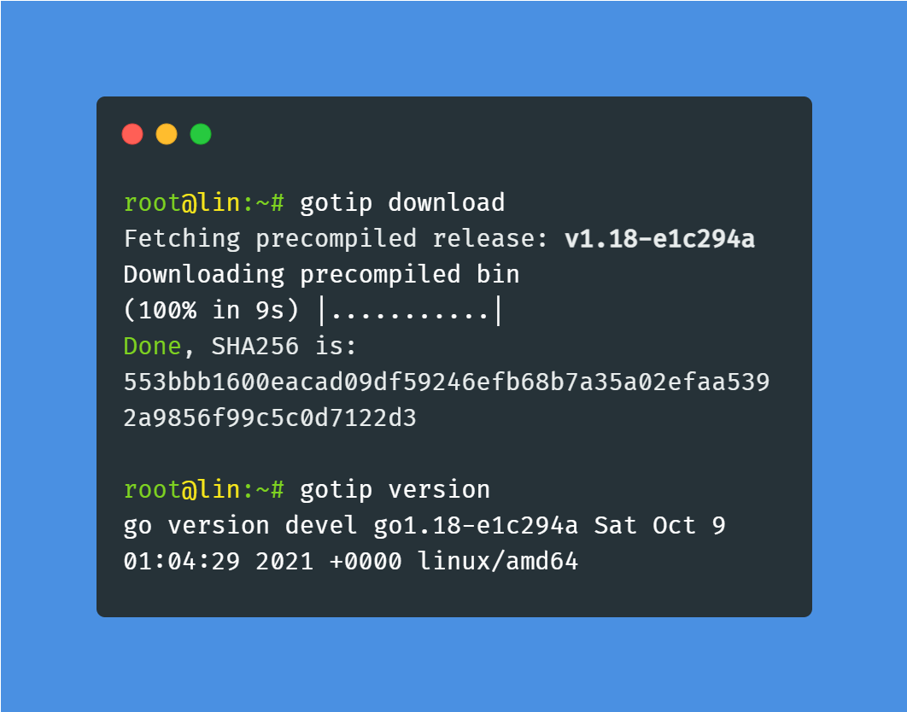

### Daily builds of golang dev/gotip 

Using [gotip](https://pkg.go.dev/golang.org/dl/gotip) to install dev versions of go can delay
CI/unit tests for **4+ minutes**
as it goes through the whole toolchain compiling process. 

<p align="center">
  This repo fixes that by storing precompiled daily gotip builds: <br/>
  
</p>

As of October, the most useful gotip features are [fuzz testing](https://go.dev/blog/fuzz-beta), and of course, [Go generics](https://github.com/golang/go/labels/generics). Note that gotip is **made for golang devs, and certainly not ready for production.**

💾**Installation**:
```bash
go install github.com/clean8s/gotip-built/gotip@latest
gotip download
```
Then you can use gotip as usual `go`: `gotip install`, `gotip mod tidy`, ...

**You can also manually extract the build from the [GitHub Releases](https://github.com/clean8s/gotip-built/releases), if you set your PATH, GOROOT and GOPATH manually.**

---

**🔒 Verifying download hash**:

The `download` command outputs
the SHA-256 hash of the lz4 artifact (it's calculated on-the-go as blocks get downloaded & uncompressed).
You can check whether it matches the artifact generated by
the [GitHub Action](https://github.com/clean8s/gotip-built/actions/workflows/gotip-dw.yml) - as well as verify the build steps.

🚀 **Supported platforms**:

* darwin_amd64
* windows_amd64
* linux_amd64
 
Looking for ARM64 pull requests! The current GH Action is a bit messy since it uses Powershell (win) and Bash (darwin/linux) at the same time, so it should get refactored into a tidier Makefile or a go tool.
